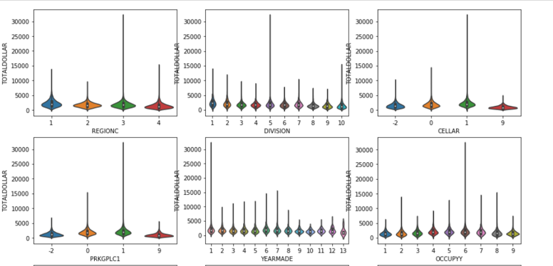
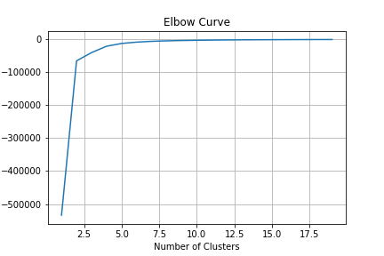
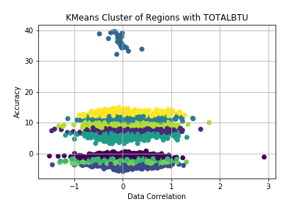
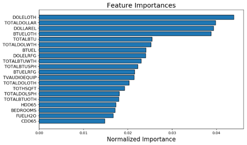

# Residential Energy Prediction

Contents:
[Project Overview and flow](#Overview)
[Data Transformatio and Merging](#Data-Transformation-and-Merging)
[PCA and KMeans clustering](#PCA-and-KMeans-clustering)
[Feature Selector](#Feature-Selector)

## Overview
We are visualizing and predicting the usage of energy across the US. Our resource used was from the Residential Energy Consumption Survey(RECS).
 
Using Machine learning tools and techniques, we aim to predict,

1. Total Consumption of Energy in residential homes
2. Total Cost in dollar for the energy consumed

RECS data for 2001, 2009, 2015 were used  to train and test our ML Models. Data extracted from US eia site ( https://www.eia.gov/consumption/residential/index.php) was cleaned and merged into one CSV file. 

With a combination of PCA and KMeans to study any obvious clustering or patterns. This then fed into determing X (predictors) for the models.

Feature Engineering : Using Feature Engineering tools such as Feature Selector and PCA we determined the amount of features necessary for prediction. Post determining important features, an array of ML modeling techniques were used for prediction.

Below flow chart explains the model development process 

## Data Transformation and Merging

#### The RECS survey data consisted of 500+ variables collected across housing characteristics, appliances used, fuel types, annual consumption and cost of consumption. 

- Data Exploration was done using Violin, Box-whisker and Distribution plots to understand type, distribution and correlation of variables. Based on the data Exploration,  we applied transformation on data such as, dropping unnecessary columns, converting all to one unit and creation of calculated columns.

- MISSING VALUES TREATMENT : 
    * Categorical values – Mode used to fill missing values 
    * Numerical values – median used to fill missing values 
- OUTLIER TREATMENT:  Using Box plots, outlier were identified and dropped. For example, rows with Total BTU (> 210000) and Total Dollar (> 4000) columns were dropped. 

## PCA and KMeans clustering

** Principle Component Analysis (PCA) is a dimension-reduction tool. Plugging in the data from the combined set through PCA an elbow curve is created to show how many features can be used to predict model accuracy. 

- Creating a scree plot of the results shows which components has a higher percentage of explained variance.

- The columns names from the RESC plot are represented as PC1, PC2, etc. A comparison can then be made between two components to further analyze the relationship between their data and the other features. 

PCA Elbow curve showing features that explain most of the variance (above 95%)

An example of PCA correlation - variance plot - 

### KMeans clustering
** After exporting the PCA components, we reimport the new CSV to use for KMeans Clustering. KMeans can be used to determine clusters of data and make decisions based off the clusters which values you can exclude to increase accuracy.  

- Using the variable REGIONC and TOTALBTU, the KMeans elbow curve shows the clusters needed to group the data is between 8 and 10, when the curve flattens at 0 score value. 

- Creating a scatter plot of 10 clusters with the PCA transformed x and y plots (REGIONC and TOTALBTU), the graph shows alot of the data in general correlates to predicting the values of x and y, with another cluster that does not correlate and can be reduced from the data set. 

## Feature Selector
Post Data Merging and Transformation, we had 185 features that were put through feature engineering to optimise dimensions.

Feature Selector used five methods used to identify features to remove:
- Missing Values – Any feature with 60% of data missing is removed.
- Single Unique Values- Any constant Values across the dataset is removed. 
- Collinear Features-Identify features with 98% correlation. 
- Zero Importance Features – Identify zero importance features after one hot encoding. 
- Low Importance Features-Identify features with Low importance (i.e. where cumulative importance is below the threshold of 95 %) 

